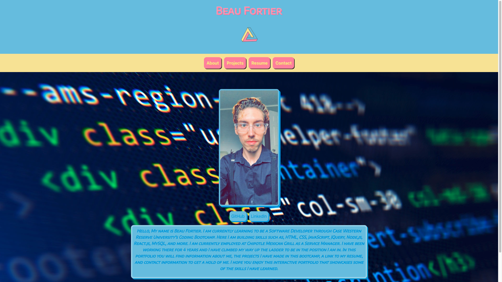

# React Portfolio
This is another updated version of my Web Development Portfolio. This version is completed revamped from the last one.

## Purpose
This application is an interactive portfolio made to showcase the 
skills I have built so far in CWRU's Coding Bootcamp. It contains an about me section, a project section, a contact info section, and a resume section. It also contains links to my LinkedIn and GitHub profiles, as well as links to my deployed applications and their repositories.

## Technologies
* VSCode
* HTML
* CSS
* JQuery
* Bootstrap
* APIs
* MySQL
* Sequelize
* Express
* Handlebars
* MongoDB
* Mongoose
* React

## Links to Deployed Applications
* Project PokeDex - https://ayylam0.github.io/Pokedex-project/
* Employee Scheduler - https://employee-scheduler-project.herokuapp.com/
* Budget Tracker - https://morning-shelf-90642.herokuapp.com/
* Employee Directory - https://beau4ta.github.io/reactEmployeeDirectory/
* MERN GOogleBooks - https://immense-bastion-60160.herokuapp.com/
* Reel Films - https://frozen-ravine-79137.herokuapp.com/.

GitHub: https://github.com/beau4ta/reactPortfolio

Deployed Application: https://beau4ta.github.io/reactPortfolio/

GitHub Profile: https://github.com/beau4ta
LinkedIn: https://www.linkedin.com/in/beau-fortier-388058192/
Resume: https://docs.google.com/document/d/1sT0MH_7ZvKa4lNsWrU_r68qg7Cs_rDuzUEKgTDQTgRE/edit?usp=sharing

Email: beaufortier13@gmail.com

